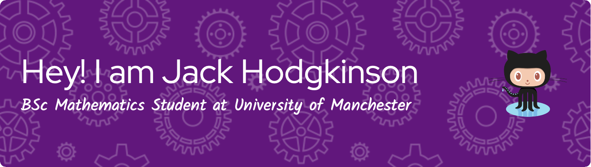

  

- 📫 How to reach me **jnhodgkinson2010@hotmail.co.uk**

- ⚡ Fun fact **I am a PADI Advanced Open Water Scuba Diver**

<h3 align="left">Connect with me:</h3>

<h3 align="left">Languages and Tools:</h3>

 </a>  

&nbsp;

